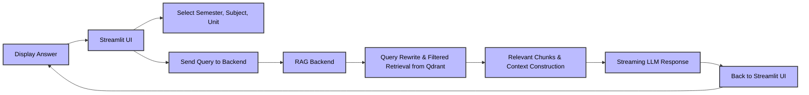

# RAG Frontend

**Streamlit frontend** for the RTU syllabus **RAG Chatbot**, allowing users to select **semester, subject, and unit**, ask questions, and receive **streaming answers** from the backend.

---

## 🗂️ Repo Structure

```
root/
├── .github/workflows/deploy.yml   # CI/CD workflow
├── .streamlit/config.toml         # Streamlit config
├── .dockerignore
├── .gitignore
├── Dockerfile                     # Docker image build
├── requirements.txt
├── semester_subjects.json         # Mapping: semester → subjects
├── subjects_mapping.json          # Mapping: subject name → subject code
├── subjects_units.json            # Mapping: subject code → units
└── streamlit_ui.py                # Streamlit UI and chat logic
```

---

## ⚡ Features

* Interactive **Streamlit UI** for RAG queries
* Dropdowns for **semester, subject, and unit selection**
* Maintains **chat history** during session
* Streams **LLM responses** from the backend in real-time
* CI/CD deployment via **GitHub Actions → AWS ECR → EC2**

---

## 🖥️ Frontend Architecture



---

### **Flow Explanation**

1. **User selects** semester, subject, and unit in Streamlit sidebar.
2. **User asks a question** → Streamlit sends it to the backend via `/rag/query`.
3. **Backend processes query**:

   * Query rewrite for better retrieval
   * Filtered retrieval from **Qdrant**
   * Context construction
   * Streaming LLM response generation
4. **Streaming response** is sent back to Streamlit UI.
5. User sees **real-time answer**, with chat history maintained.

---

## 📦 Dependencies

* `streamlit` → UI
* `requests` → Communicate with backend
* JSON files → Populate dropdowns for semester, subject, and unit

---

## ⚙️ CI/CD Workflow Overview

* Triggered on push to `master` branch
* Steps:

  1. Checkout code
  2. Configure AWS credentials
  3. Login to ECR
  4. Build Docker image
  5. Push image to ECR
  6. Deploy container on EC2

---

## ✅ Notes

* Streams backend responses **in real-time**
* Maintains **chat history** for context-aware answers
* Safe to deploy via CI/CD as workflow automatically pulls the latest image

---
